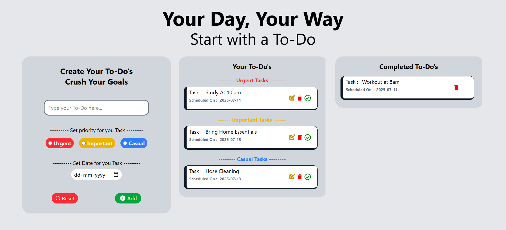

# ✅ To-Do App

A responsive, interactive and clean **To-Do List** app built with **React** and **Tailwind CSS**, featuring editable tasks, priority levels, scheduled dates, and intuitive controls for managing your daily tasks effectively.

---------------------------------------------------------------------

## ✨ Features
- 📝 **Create, Edit, and Delete** tasks
- ✅ **Mark tasks as complete**
- 🗓️ **Schedule** tasks with a date input
- 🎯 **Prioritize** tasks as `Urgent`, `Important`, or `Casual`
- ✏️ **Inline editing** of task title and due date
- 💾 **Save changes** instantly
- 🧼 **Clean and responsive UI** using Tailwind CSS
- 📱 **Mobile-friendly design**


---------------------------------------------------------------------


## 📸 Preview


---------------------------------------------------------------------


## 🧠 How It Works
**Each task has:**
A title (editable)
A scheduled date
A priority level (urgent, important, casual)
A completion status

**Users can:**
Toggle between edit mode and view mode
Choose priority during task creation
Delete or complete tasks using action icons


---------------------------------------------------------------------

## 🚀 Tech Stack
- **React** (Functional components + hooks)
- **Tailwind CSS** for styling
- **React Icons** for interactive UI buttons

---------------------------------------------------------------------

## 📁 Project Structure
<pre>``` 
To-Do-App/
├── public/
│ ├── index.html
│ └── Preview.png
│
├── src/
│ ├── components/
│ │ ├── TaskBox.jsx
│ │ └── TodoForm.jsx
│ │
│ ├── contexts/
│ │ ├── index.js
│ │ └── TodoContext.js
│ │
│ ├── App.jsx
│ ├── App.css
│ ├── index.css
│ ├── main.jsx
│
├── .gitignore
├── package.json
├── package-lock.json
├── vite.config.js
└── README.md
``` </pre>

---------------------------------------------------------------------


## 🔧 Installation & Setup
```bash
# Clone the repository
git clone https://github.com/Shreeyog-Gaikwad/To-Do-App.git
cd To-Do-App

# Install dependencies
npm install
npm install tailwindcss @tailwindcss/vite

# Start the development server
npm run dev
```


---------------------------------------------------------------------


## 🤝 Contributing
Pull requests are welcome. For major changes, please open an issue first to discuss what you'd like to change.

---------------------------------------------------------------------

> Made with ❤️ by [Shreeyog Gaikwad](https://github.com/Shreeyog-Gaikwad)